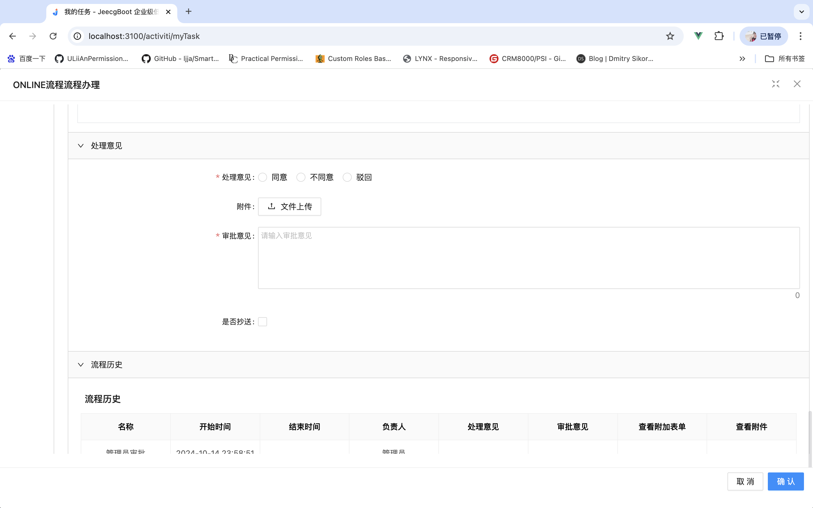

## 介绍

JeecgActiviti是基于JeecgBoot开源版本集成工作流解决方案，遵循BPMN2.0国际标准，具有更稳定、更健壮的工作流性能。

基于Activiti 8 进行中国流程特色扩展，更符合国内流程需求；主要功能包含在线流程设计器，实现在线画流程；在线表单设计器，实现在线设计表单（在线配置表单）,表单挂接,业务流转，流程监控，流程跟踪，流程委托、抄送功能、代理，超时提醒、并行会签、串行会签等。实现功能包括：

```
│─流程模块功能 
│  ├─流程设计器(整合Online表单和自定义表单)
│  └─我的任务
│  └─历史任务
│  └─历史流程
│  └─流程实例管理
│  └─流程监听管理
│  └─流程表达式
│  └─我发起的流程
│  └─我的抄送
│  └─流程挂起、委派、抄送、驳回、跳转、关闭、取回
│  └─流程与表单关联（松耦合设计）
│  └─表单支持发起多次流程
│  └─流程催办
│  └─表单提醒
│  └─等等

```

如果您对JeecgBoot不了解，请移步JeecgBoot项目介绍 [http://www.jeecg.com](http://www.jeecg.com)

## 前端源码


添加微信免费获取完整源码


## 项目演示


流程创建

流程设计

部署流程

发起流程


我的任务


历史任务


我的工单
